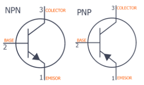
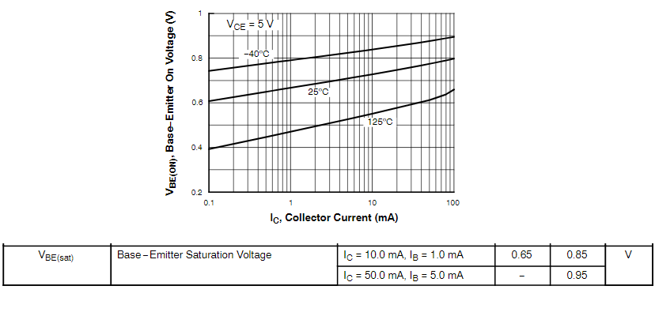
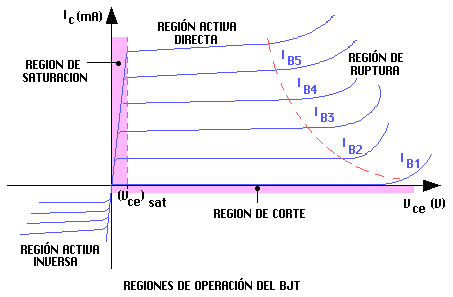
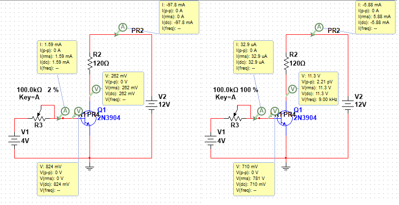
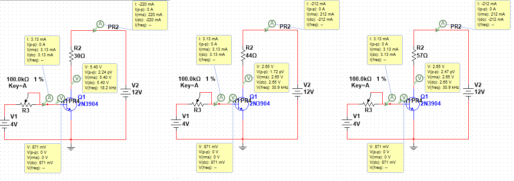
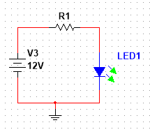
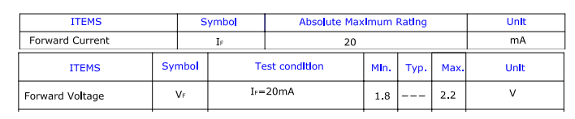
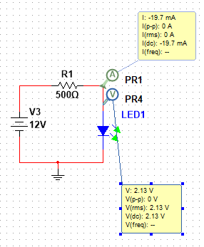
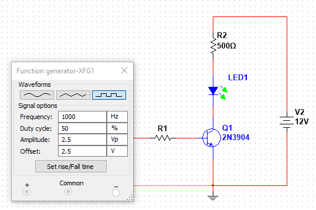
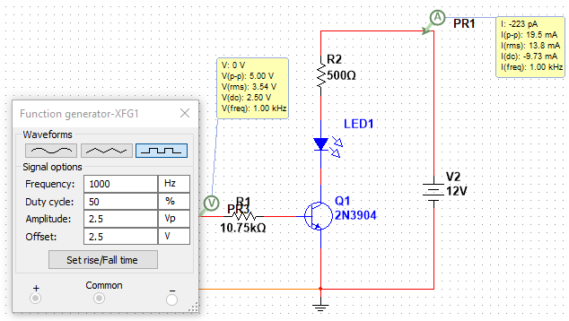

# Transistores BJT en corte y Saturación
# Introducción

Los transistores BJT presentan múltiples ventajas cuando se utilizan como drivers de potencia. Por ejemplo permiten la conmutación de señales de alta potencia, a través de señales de baja potencia. Tienen tiempos de vida mucho más largos que dispositivos electromecánicos que realizan estas mismas tareas, por ejemplo relés o contactores. En este documento se lleva a cabo un ejemplo de diseño utilizando un transistor BJT NPN (2n2222), los cuales son muy utilizados en ambientes prácticos.

El símbolo del transistor BJT es:

A diferencia de la tecnología MOSFET, estos transistores permiten variaciones de corriente en el colector, por medio de variaciones de corriente en la base. Para este documento solamente se considerará la configuración emisor común.

En esta figura se pueden observar diferentes características a considerar. por ejemplo:

   -  Las curvas características cambian dependiendo de la temperatura, por lo que diseñar corrientes adecuadas que no provoquen autocalentamientos en el transistor es importante para mantener adecuadas las condiciones de funcionamiento del BJT 
   \item{ A temperatura ambiente (25°C) es necesario alcanzar una tensión $v_{\textrm{BE}}$ de aproximadamente 0.7 V para lograr que el transistor empiece a conducir corriente por el colector }

# Zonas de trabajo

Los transistores BJT tienen 3 zonas de trabajo, las cuales definen como va acomportarse el transistor. Por un lado la zona de corte no permite que se conduzca corriente a través del colector. A diferencia de los transistores MOSFET, en los BJT la zona de saturación se utiliza para conducir corriente a través del colector como si se cerrara un interruptor. Por último la región activa es aquella donde la corriente de colector se mantiene constante sin importar los cambios en la tensión $v_{\textrm{CE}}$; para usar esta zona lo recomendable es agregar un circuito de polarización, ya que fácilmente se puede pasar de la región activa a la zona de ruptura dle transistor.

Las zonas de trabajo del MOSFET presentan unas características únicas en el comportamiento:

   -  **Región Corte: **El transistor estará en esta región, cuando $I_B =0\;A$. En estas condiciones el transistor BJT, equivale eléctricamente a un circuito abierto, entre los terminales del colector y emisor. De acuerdo con el modelo básico del transistor, en esta región, el dispositivo se encuentra apagado. No hay conducción entre colector y emisor, de modo que el BJT se comporta como un interruptor abierto 
   \item{ **Región Saturación: **El transistor BJT entra en esta zona de funcionamiento cuando la tensión entre el colector y el emisor$\left(V_{\textrm{CE}} \right)$ esta por debajo de un valor fijo denominado tensión de saturación (Vce sat) Colector*-Emisor*; este valor viene determinado en las hojas características proporcionadas por el fabricante. En esta zona, el BJT entrega corriente casi proporcionalmente a la corriente de base. En este caso se considera al transistor BJT un circuito cerrado }

Es decir; el BJT estará en esta región, cuando $V_{\textrm{CE}}$** < **$V_{{\textrm{CE}}_{\textrm{SAT}} }$ y $I_B$** ****> **$I_{B_{\textrm{ON}} }$

   \item{ **Región Activa: **El transistor BJT entra en esta zona de funcionamiento cuando la tensión entre el Colector y el Emisor $\left(V_{\textrm{CE}} \right)$ supera un valor fijo denominado tensión de saturación (Vce sat) Colector-Emisor; este valor viene determinado en las hojas características proporcionadas por el fabricante. En esta zona, el BJT mantiene constante su corriente de Colector $\left(I_C \right)$, independientemente del valor de tensión que haya entre el colector y emisor $\left(V_{\textrm{CE}} \right)$. Por lo tanto, el transistor equivale a un generador de corriente continua de valor $I_C$.  }

## Medición de parámetros

Para ilustrar el funcionamiento de las zonas de corte y saturación se utilizará un circuito de prueba, donde se alimentará una carga resistiva. Los valores utilizados han sido selesccionados arbitrariamente para ilustrar el funcionamiento.

En la figura anterior se observa que con una corriente de base $I_B =1\ldotp 59\textrm{mA}$ se consigue una tensión colector-emisor $v_{\textrm{CE}} =262\;\textrm{mV}$ lo cual indica que el transistor esta en saturación, ya que este se esta comportando prácticamente como un circuito cerrado. En la gráfica derecha se observa que la corriente de base $I_B =32\ldotp 9\;\textrm{uA}$ se consigue una tensión colector-emisor $v_{\textrm{CE}} =11\ldotp 3\;V$ lo cual indica que el transistor está en corte ya que prácticamente toda la tensión de la fuente de potencia esta cayendo allí.

En la siguiente figura se realizan cambios en la carga para mostrar el comportamiento en la región activa:

En la figura anterior se puede observar que manteniendo fija la corriente de base $I_B =3\ldotp 31\;\textrm{mA}$ se mantiene prácticamente fija la corriente de colectar, aún cuando se realizan cambios de carga; lo anterior permite concluir que el transistor está en la regío activa. Aunque se logró solo agregando resistencia de base al circuito, esta región tiene un comportamiento muy inestable y es necesario un circuito de polarización más robusto y con más elementos, con el fin de asegurar estabilidad en la amplificación.

# Procedimiento de diseño

A continuación se presenta el procedimiento de diseño para aliemntar un led por medio de una señal de PWM. Recapitulando lo anterior, si se quiere trabajar con una señal PWM de control, lo que se requiere es trabajar el transistor en corte y saturación. Es decir, en corte tendrá ausencia de voltaje en el lado de la base y en saturación se tendrá el nivel alto del pulso en el lado de la base.

Teniendo en cuenta esto, se puede decir que se quiere prender y apagar el led a una frecuencia que sea imperceptible para el ojo humano. Para esto se utilizará una frecuencia de 1 kHz. Es importante recordar que un led necesita una resistencia en serie para prevenir que se dañe cuando conduzca, por lo cual lo primero que se realizará es el cálculo de dicha resistencia.

## Cálculo resistencia LED

Para este diseño se puede asumir que se comportará como un circuito serie como el de la figura

Al ser un LED verde se debe consultar la tensión y corriente de este componente para realizar los cálculos respectivos. Se sabe que a 12 V se quiere la máxima luminosidad

Los anteriores datos indican que la máxima corriente que se puede permitir en el LED en directo es 20 mA, y la caída de tensión a esa corriente es en promedio 2 V. Se concluye que cuando el transistor BJT esté en saturación debe permitir solo esta corriente, de lo contrario el led puede dañarse.

Realizando la malla se obtiene:

$$
\begin{array}{l}
12=R_1 *20\;\textrm{mA}+2\;V\\
R_1 =500\;\Omega 
\end{array}
$$

Con esto se combrueba que para un LED verde no es conveniente utilizar las acostubradas resistencias de 220 o 330 ohms, debido a que se deja pasar más corriente por el LED y corre peligro.

## Diseño resistencia de base

Teniendo clara la carga que debe alimentar el transistor, ahora se procede con el diseño de la resistencia de base para que el transistor trabaje en corte y saturación adecuadamente:

A partir de este circuito se plantean las ecuaciones de entrada y salida:

La ecuación de entrada sería la siguiente asumiendo el peor caso que es en saturación, es decir con voltaje de 5V:

$$
5\;V=I_B *R_B +0\ldotp 7\;V
$$

La ecuación de salida sería:

$$
12\;V=20\;\textrm{mA}*500\;\Omega +2\;V+v_{\textrm{CE}}
$$

Como se considera el caso en que el transistor está en saturación, entonces $v_{\textrm{CE}} =0$

Sabiendo que el $\beta =50$ (Se debe medir por medio de un multímetro que cuente con esta opción) entonces se usa la relación de ganancia de los transistores BJT

$\beta =\frac{I_C }{I_B }$  por lo tanto, la corriente de base $I_B =\frac{20\;\textrm{mA}}{50}=400\;\mu A$

Con esta información es posible encontrar $R_B$

$$
\begin{array}{l}
5\;V=400\;\mu A*R_B +0\ldotp 7\;V\\
R_B =\frac{5-0\ldotp 7}{400\;\mu A}=10\ldotp 75\;k\Omega 
\end{array}
$$

En la simulación se observa que la corriente pico a pico en el colector es de 19.5 mA, es decir que se está cumpliendo con el diseño propuesto, dando la máxima corriente cuando el transistor esta en saturación.

# Conclusión

A partir de lo realizado en el presente documento se ha podido concluir lo siguiente:

   -  Los transistores BJT son dispositivos que conducen grandes corrientes a la salida (colector) a partir de pequeñas corrientes en la entrada (base) 
   -  Cuando se utiliza el transistor BJT como driver de potencia, se recomienda que el transistor ttrabaje solo en las regiones de corte y saturación.  
   -  La región activa esta reservada para usar el transistor como amplificador de voltaje, requiere de un circuito de polarización más robsto que una simple resistencia de base
