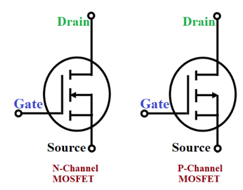
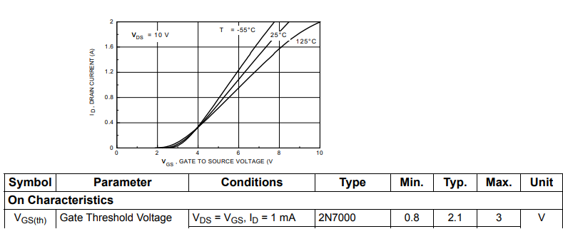
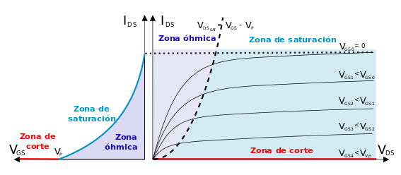
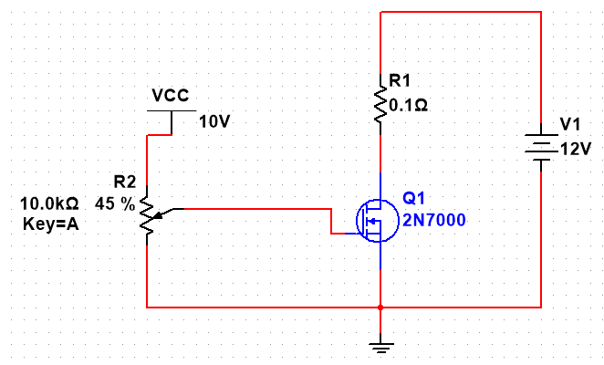
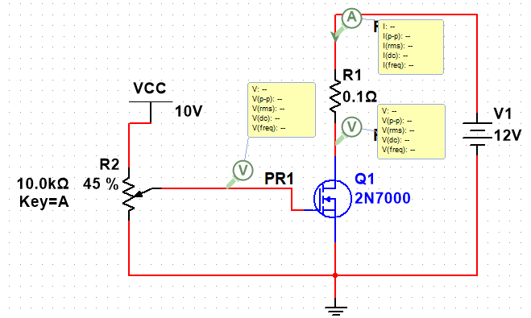
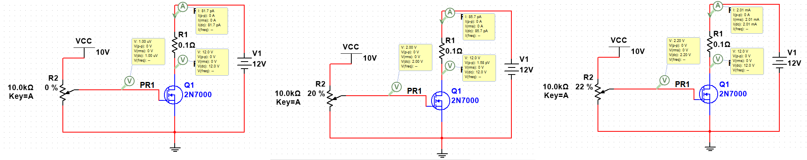
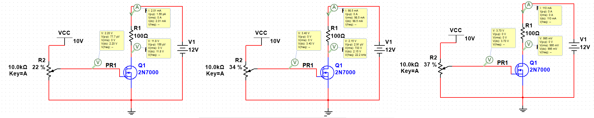
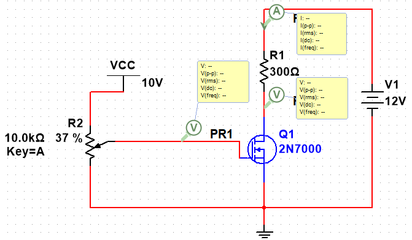
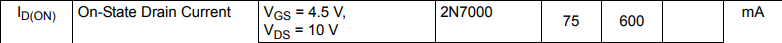
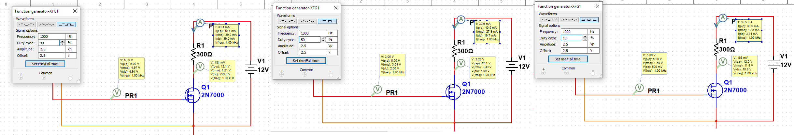

# MOSFET en región Óhmica
  
# Introducción

Los transistores MOSFET presentan múltiples ventajas cuando se utilizan como drivers de potencia. Por ejemplo permiten la conmutación de señales de alta potencia, a través de señales de baja potencia. Tienen tiempos de vida mucho más largos que dispositivos electromecánicos que realizan estas mismas tareas, por ejemplo relés o contactores. En este documento se lleva a cabo un ejemplo de diseño utilizando un transistor MOSFET de enriquecimiento (2n7000) canal N, los cuales son muy utilizados en ambientes prácticos.

El símbolo del transistor MOSFET es:

Este transistor presenta diferencias con respecto a los BJT, ya que permite variaciones de corriente en el Drain, por medio de variaciones de tensión (voltaje) entre Gate y Source. Para este documento solo se considerará una configuración Source común.

La curva característica de un transistor MOSFET es como la siguiente:

En esta figura se pueden observar diferentes características a considerar. por ejemplo:

   -  Las curvas características cambian dependiendo de la temperatura, por lo que diseñar corrientes adecuadas que no provoquen autocalentamientos en el transistor es importante para mantener adecuadas las condiciones de funcionamiento del MOSFET 
   \item{ Para tensiones muy bajas entre Drain-Source el transistor no conduce la corriente en el Drain. En la curva se puede observar que hay una tensión mínima para que inicie a conducir, esta se denomina $V_{{\textrm{GS}}_{\textrm{TH}} }$(tensión gate-source de disparo). En el caso de la curva de 25°C se observa que para esta referencia de transistor está cercana pero menor a 3 V. Revisando las características de funcionamiento (datasheet) la mínima es 0.8 y la máxima es 3. Esta tensión debe medirse en cada transistor. }
   -  El comportamiento de este tipo de transistores está modelado por medio de la ecuación de Shockey, la cual tiene la siguiente forma: 

                $I_D ={K\left(V_{\textrm{GS}} -V_{{\textrm{GS}}_{\textrm{TH}} } \right)}^{2\;}$ En esta ecuación se ve el efecto del votaje mínimo de disparo del transistor y una constante K que            tambien depende del transistor y la temperatura, pero puede ser deducida matemáticamente. Se mostrará en el diseño posteriormente

# Zonas de Trabajo

El MOSFET tiene 3 zonas de trabajo las cuales definen como va a comportarse el transistor. Por un lado, la zona de corte no permite conducción de corriente en el Drain. La zona de saturación es donde la corriente de Drain se mantiene constante, independiente de la carga; esta zona requiere un circuito de polarización. Por último, la zona óhmica es donde el MOSFET se comporta como una resistencia variable; esta zona es la que se utiliza para entregar corriente a una carga.

Las zonas de trabajo del MOSFET presentan unas características únicas en el comportamiento:

   \item{ **Región Corte: **El transistor estará en esta región, cuando $V_{\textrm{GS}}$** < **$V_{{\textrm{GS}}_{\textrm{TH}} }$. En estas condiciones el transistor MOSFET, equivale eléctricamente a un circuito abierto, entre los terminales del Drain-Source. De acuerdo con el modelo básico del transistor, en esta región, el dispositivo se encuentra apagado. No hay conducción entre Drain y Source, de modo que el MOSFET se comporta como un interruptor abierto }
   \item{ **Región Saturación: **El transistor MOSFET entra en esta zona de funcionamiento cuando la tensión entre el Drain y el Source $\left(V_{\textrm{DS}} \right)$ supera un valor fijo denominado tensión de saturación (Vds sat) Drain*-Source*; este valor viene determinado en las hojas características proporcionadas por el fabricante. En esta zona, el MOSFET mantiene constante su corriente de Drain $\left(I_D \right)$, independientemente del valor de tensión que haya entre el Drain y el Source $\left(V_{\textrm{DS}} \right)$. Por lo tanto, el transistor equivale a un generador de corriente continua de valor $I_D$. }

Es decir; el MOSFET estará en esta región, cuando $V_{\textrm{GS}}$** ****> **$V_{{\textrm{GS}}_{\textrm{TH}} }$ y $V_{\textrm{DS}}$** ****> ( **$V_{\textrm{GS}}$** ****– **$V_{{\textrm{GS}}_{\textrm{TH}} }$** ****)**

   \item{ **Región Óhmica: **Cuando un MOSFET está polarizado en la *región óhmica*, el valor de $R_{\textrm{DS}}$(on) viene dado por la expresión: }

$V_{\textrm{DS}}$(on) = $I_D$(on) x** **$R_{\textrm{DS}}$**(on) **

En casi todas las hojas de datos, asocian el valor de RDS(on) a una corriente de Drenaje (ID) específica y el voltaje Gate-                    Source.

Por ejemplo, si $V_{\textrm{DS}}$(on)=1V y $I_D$(on)=100mA = 0,1 A; entonces,

$$
R_{\textrm{DS}} \left(\textrm{on}\right)=\frac{\left(1V\right)}{100\textrm{mA}}=10\Omega
$$

Así mismo, el transistor estará en la *región óhmica*, cuando $V_{\textrm{GS}}$** ****> **$V_{{\textrm{GS}}_{\textrm{TH}} }$** ****y **$V_{\textrm{DS}}$** ****< ( **$V_{\textrm{GS}}$** ****– **$V_{{\textrm{GS}}_{\textrm{TH}} }$** ****)**.

El MOSFET equivale a una resistencia variable conectada entre el Drain y Source. El valor de esta resistencia varía dependiendo del valor que tenga la tensión entre la Gate y el Source $V_{\textrm{GS}}$.

## Medición de parámetros

Los parámetros de $V_{{\textrm{GS}}_{\textrm{TH}} }$, $I_{D_{\textrm{ON}} }$, $V_{{\textrm{DS}}_{\textrm{ON}} }$ pueden ser medidos a partir de un circuito muy simple. Estos parámetros son necesarios para llevar a cabo un muy buen diseño, ya que los fabricantes en sus datasheets dan rangos muy amplios para estos parámetros, lo cual puede inducir a errores grandes si se usan estos valores.

El siguiente es el circuito que debe implementarse para realizar las mediciones correspondientes:

  

Como se observa en la figura solamente se necesita el MOSFET, una fuente variable entre Gate y Source, la cual se ha adaptado por medio de un potenciómetro; la fuente de potencia, la cual debería ser del valor con que se alimentará la carga y una pequeña carga que permita identificar los valores de $I_D \;y\;V_{\textrm{DS}}$. Agregando los medidores el circuito quedaría de la siguiente forma.

El procedimiento de medición es muy fácil de realizar, la prueba consiste en empezar a variar la tensión entre Gate y Source para encontrar el $V_{{\textrm{GS}}_{\textrm{TH}} }$. En las imágenes de abajo se muestra las lecturas de los instrumentos para diferentes valores de esta tensión

En la figura se puede observa que en la izquierda se inicia con $V_{\textrm{GS}} =0\;V$ para lo cual se obtiene una $I_D =81\;pA$, los cual indica que que el transistor MOSFET se está comportando como un circuito abierto (zona de corte) y que solamente está circulando por el Drain la corriente de fuga. En el centro se observa que se incrementó $V_{\textrm{GS}} =2\;V$ y la corriente $I_D =85\;\textrm{pA}$la cual es insignificante por lo tanto se considera que sigue en zona de corte el MOSFET, es decir no permite la conducción de corriente a través del Drain. En la última se puede observar $V_{\textrm{GS}} =2\ldotp 2\;V$ para lo cual se obtiene un incremento significativo de $I_D =2\;\textrm{mA}$ , es decir que ya está conduciendo el MOSFET, porque esta permitiendo que através de la carga circule dicha corriente. Lo que indica que $V_{{\textrm{GS}}_{\textrm{TH}} } =2\ldotp 2\;V$ para este transistor, esta tensión cambia para cada transistor así sea de esta misma referencia por lo cual se recomienda siempre medir este parámetro ya que el fabricante indica que esta tensión puede estar entre 0.8V y 3V, que es un rango muy amplio para realizar cualquier diseño.

Solamente como demostración del trabajo en la región de saturación, se ha modificado la carga del circuito anterior para que se vea con claridad el comportamiento del MOSFET en zona de saturación.

En la figura (izquierda) se evidencia que aunque se cambió la carga, la tensión $V_{{\textrm{GS}}_{\textrm{TH}} }$ no cambia ya que este es un parámetro característico del transistor, no del circuito. En la figura (centro) también se observa que con $V_{\textrm{GS}} =3\ldotp 4\;V$ está a punto de ingresar a zona de saturación ya que $V_{\textrm{DS}} =2\ldotp 15\;V$ es apenas superior a $V_{\textrm{GS}} -V_{{\textrm{GS}}_{\textrm{TH}} } =1\ldotp 2V$. En la figura derecha se observa que ya se cumple la condición de la zona de saturación ya que  $V_{\textrm{DS}} =995\;mV$ es inferior a $V_{\textrm{GS}} -V_{{\textrm{GS}}_{\textrm{TH}} } =1\ldotp 5V$; si se sigue incrementando la tensión $V_{\textrm{GS}}$ entonces la corriente $I_D$ incrementará muy poco con respecto a la tensión. Para trabajar en la zona de saturación se debe implementar otro tipo de circuitos de polarización en el transistor MOSFET que garanticen estabilidad, debido a que de la región de stauración es muy fácil pasar a la región de ruptura del dispositivo.

Por lo anterior cuando se quiere utilizar el MOSFET como un interruptor, se recomienda hacerlo con el punto de operación en la región óhmica.

# Procedimiento de diseño

A continuación se realizará el diseño para alimentar una carga de 300$\Omega$ a la cual se requiere entregarle una corriente variable entre 0 y 200mA através de la variación de ciclo útil de un PWM como señal de control del interruptor MOSFET.

De la hoja de datos del transistor se sabe que la $I_{D_{\textrm{ON}} } =600\;\textrm{mA}$ típicamente

El fabricante indica que esta coriente se presenta con una tensión $V_{\textrm{GS}} =4\ldotp 5\;V$ sin embargo, el PWM tendrá una amplitud de 5V; por lo cual se realizará una interpolación para saber cual va a ser la corriente $I_{D_{\textrm{ON}} }$ a 5V, de manera aproximada.

Sabiendo que el MOSFET responde siguiendo esto $I_D ={K\left(V_{\textrm{GS}} -V_{{\textrm{GS}}_{\textrm{TH}} } \right)}^{2\;}$ se puede despejar la constante K para realizar la interpolación:

$$
K=\frac{600\;\textrm{mA}}{{\left(4\ldotp 5\;V-2\ldotp 2\;V\right)}^2 }=0\ldotp 1134
$$

Por lo tanto, para $V_{\textrm{GS}} =5\;V$ la corriente de Drain de encendido sería:

$$
I_{D_{\textrm{ON}} } ={0\ldotp 1134\left(5\;V-2\;\ldotp 2\;V\right)}^{2\;} =889\;\textrm{mA}
$$

Esto quiere decir que para mantener el transistor trabajando en la región Óhmica no se debería superar nunca esta corriente. Cuando esta corriente se supere se tendrá al transistor trabajando en la región de saturación.

Ahora se establecerá el análisis de la parte de potencia, por medio de LKV (Ley de Kirchoff de voltajes), suponiendo que el MOSFET se cierra completamente se obtendría la corriente máxima que se puede entregar a esta carga con el $V_{\textrm{GS}} =5\;V$

$I_D =\frac{12}{300}=0\ldotp 04\;A$ el cual está muy por debajo de la corriente de encendido ya calculada. Con esto aseguramos que el transistor trabajará en la zona óhmica, incluso si se baja un poco la resistencia por efectos del autocalentamiento u otro factor externo.

A partir del diseño anterior mente realizado los resultados se presentan en la siguiente gráfica:

En la gráfica izquierda se puede observar que se cumple el diseño realizado, ya que para el peor caso que es con 99% de ciclo útil el transistor entrega a la carga en promedio $I_D =39\ldotp 4\;\textrm{mA}$. En el centro se puede observar que al llevar el ciclo útil al 50% la tensión $V_{\textrm{DS}} =6\ldotp 09\;V$ que es aproximadamente la mitad de la tención total de la fuente de potencia, por lo cual la otra mitad la está tomando la carga. Igualmente la $I_D =32\ldotp 5\;\textrm{mA}$ esta muy por debajo de la corriente máxxima para salirse de la región óhmica de la curva de 5V. Y en la derecha se baja el ciclo útil hasta el 10% donde la corriente disminuye aún más y la tensión Drain-Source es más grande.

# Conclusiones

De acuerdo a las pruebas realizadas y el diseño realizado se puede concluir lo siguinete:

   -  El transistor MOSFET permite manejar niveles de corriente en una carga, a través de tensiones pequeñas. 
   -  La ecuación de Schokley modela el comportamiento del transistor MOSFET 
   -  A pesar de introducir varias aproximaciones dentro el diseño, los valores obtenidos en la simulación resultan bastante cercanos. También se conserva esta tendencia en la práctica. 
   -  A partir del análisis realizado, es posible deducir el diseño para cargas como un led o un motor DC
